# 

> ## Event Driven Architecture Vanilla JS Web Components codebase containing real world examples (CRUD, auth, advanced patterns, etc) that adheres to the [RealWorld](https://github.com/gothinkster/realworld) spec and API.

### [Demo](https://mits-gossau.github.io/event-driven-web-components-realworld-example-app)&nbsp;&nbsp;&nbsp;&nbsp;[Test](https://mits-gossau.github.io/event-driven-web-components-realworld-example-app/test)&nbsp;&nbsp;&nbsp;&nbsp;[RealWorld](https://github.com/gothinkster/realworld)

This codebase was created to demonstrate a fully fledged fullstack application built with Event Driven Vanilla JS Web Components including CRUD operations, authentication, routing, pagination, and more.

We've gone to great lengths to adhere to the **Document Object Model (DOM)** community styleguides & best practices.

For more information on how to this works with other frontends/backends, head over to the [RealWorld](https://github.com/gothinkster/realworld) repo.

## How it works

> Frontend Event Driven Architecture works basically like the DOM itself. There are loosely coupled components (nodes), which emmit events and those get captured by controllers also called stores, routers, etc. Those controllers emmit events on their behalf, which the components can consume.

## Getting started

> Simply open the src/index.html on a local or remote web server like, node [live-server](https://www.npmjs.com/package/live-server), apache, nginx, xampp, etc.
> Tests: Open the test/index.html

## Diagrams

### Index.html



### pages/Home.js



## Explanations

* **ShadowDOM**'s mostly shine when encapsulating CSS. But the Conduit example has one global CSS Stylesheet and for that reason, it is more efficient not to have shadowDOM's, which all would have to import that global CSS separately. Note: The biggest strength of Web Components is their shadowDOM, means in a real life examples you would share general CSS styles through CSS variables and have specific styles on each component in their respective shadowDOM. This will improve performance, since the DOM renderer only needs to respect certain CSS for certain nodes/shadowDOM's. There is a good helper Class, which you can use to simply add CSS with the lines: ```this.css = '...' ``` and to avoid resetting nodes with innerHTML, it includes a function: ```this.html = '' ```. Overall, this prototype Class helps you to easily and comfortably deal with the ShadowDOM. Have a look at: [mits-gossau/web-components *(work in progress)*](https://github.com/mits-gossau/web-components/blob/master/src/es/components/prototypes/Shadow.js)

* **Dependencie**'s: This application uses ZERO production dependencies. One devDependency is used for linting, see the package.json for further details.

* **Size**: 35 items, totalling 143.1 kB uncompressed

## Lighthouse Audits

### [React / Redux (81)](https://github.com/gothinkster/react-redux-realworld-example-app)


### [Angular (75)](https://github.com/gothinkster/angular-realworld-example-app)


### [Vue (82)](https://github.com/gothinkster/vue-realworld-example-app)


### [Vanilla JS Web Components (92)](https://github.com/gothinkster/web-components-realworld-example-app)


### Event Driven Vanilla JS Web Components (95)


## Contributions

* [TailorMadeCode](https://github.com/tailormadecode) Components Development
* [V4L3](https://github.com/V4L3) Components Development
* [Weedshaker](https://github.com/Weedshaker) Architecture, Tests & Components Development
